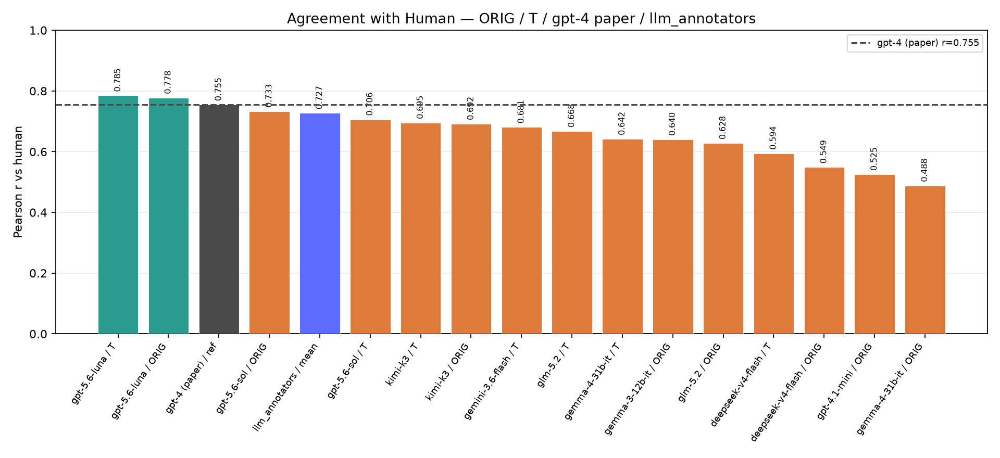
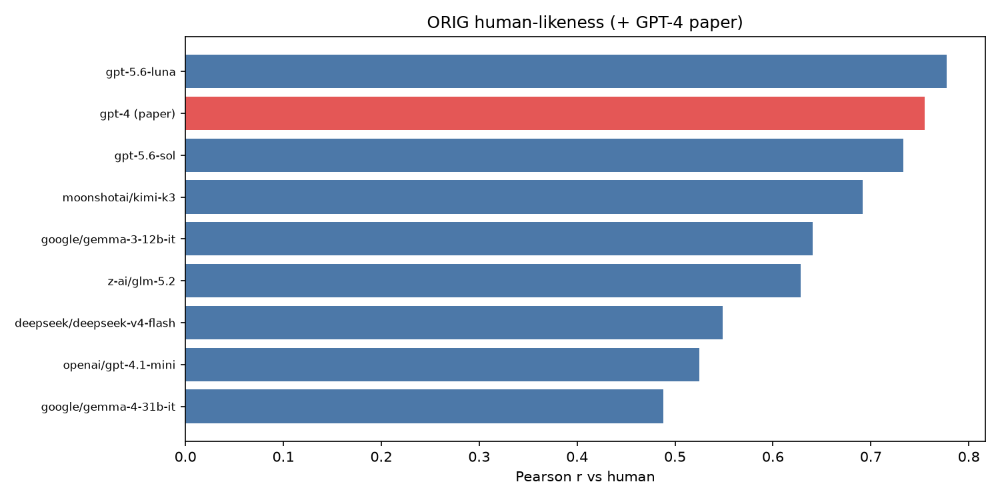
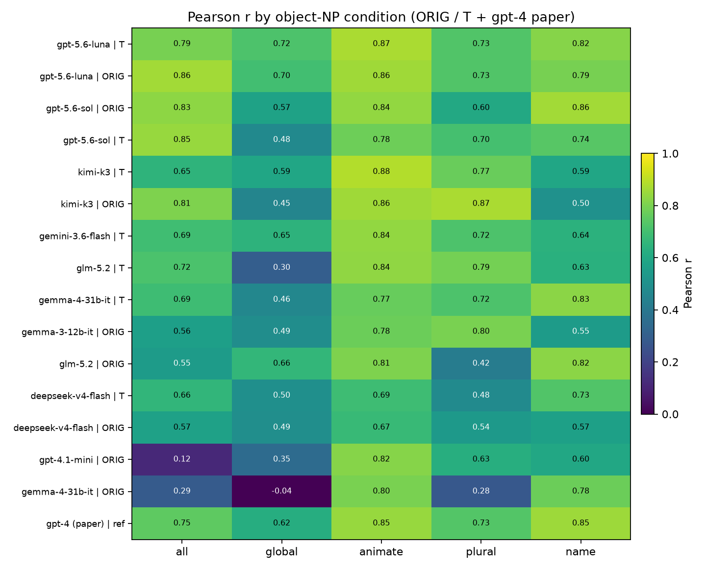
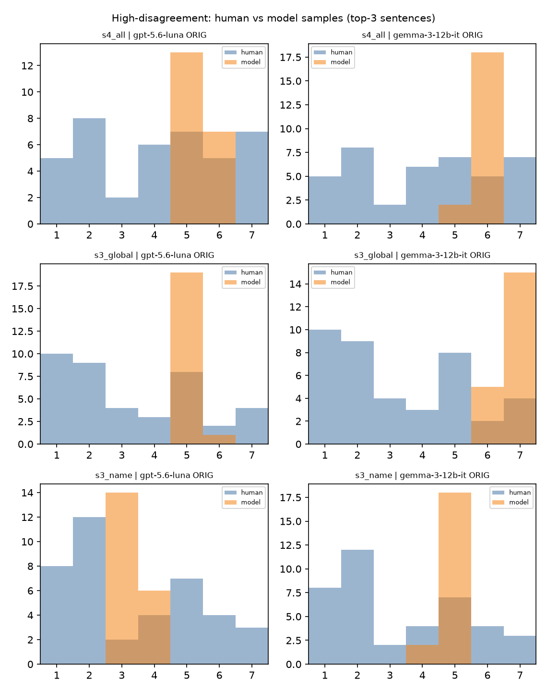
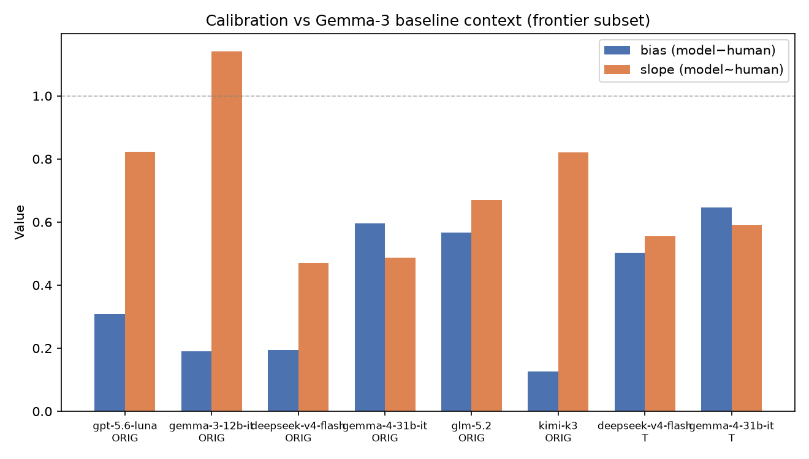
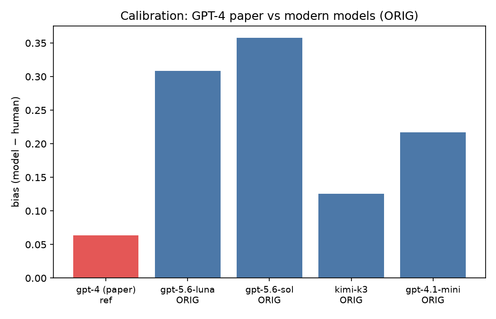
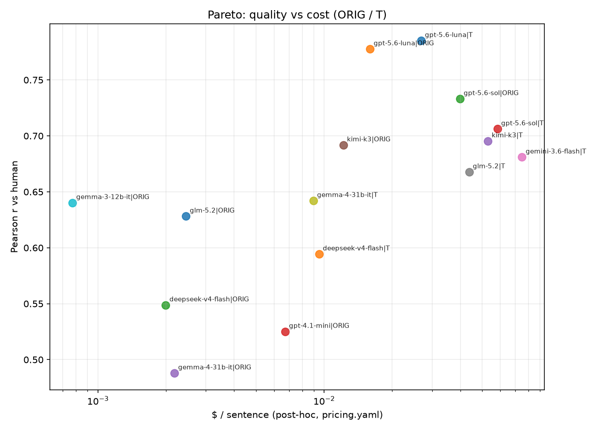

# CS2202.CH202 — Plausibility Pretesting

Đồ án cuối kỳ môn **CS2202**: đánh giá LLM làm **pretest độ hợp lý (plausibility)** câu tiếng Anh (thang 1–7), so với nhãn người của paper.

| | |
|---|---|
| **Môn** | CS2202.CH202 |
| **Giảng viên** | TS. Nguyễn Thị Quý |
| **Paper** | [Large Language Models for Psycholinguistic Plausibility Pretesting](https://arxiv.org/abs/2402.05455) (Findings of EACL 2024) — Amouyal, Meltzer-Asscher, Berant |
| **Repo** | [NguyenKz/CS2202.CH202.CK](https://github.com/NguyenKz/CS2202.CH202.CK) |
| **Upstream** | [`llm_pretesting/`](llm_pretesting/) ← [samsam3232/llm_pretesting](https://github.com/samsam3232/llm_pretesting) |

---

## Thành viên nhóm

| MSSV | Họ và tên |
|------|-----------|
| 250101049 | Trần Thảo Nguyên |
| 250101084 | Nguyễn Dương |
| 250101080 | Nguyễn Minh Chiến |

**Giảng viên hướng dẫn:** TS. Nguyễn Thị Quý

---

## Đóng góp chính

Trên **cùng model + cùng base prompt**, ablation 5 MODE so với pipeline gốc paper:

| MODE | JSON Schema | Thinking | Few-shot examples |
|------|:-----------:|:--------:|:-----------------:|
| **ORIG** | — | — | ✓ |
| **S** | ✓ | — | ✓ |
| **T** | — | ✓ | ✓ |
| **ST** | ✓ | ✓ | ✓ |
| **ST−E** | ✓ | ✓ | — |

Metric chính: **Pearson r** / MAE giữa `model_mean` và `human_mean` trên subset **`mem_enc`** (50 câu, `n_samples=20`).

Chi tiết: [`docs/08_ablation_json_thinking.md`](docs/08_ablation_json_thinking.md)

---

## Kết quả nhanh

| Hạng | Model × MODE | Pearson r | Ghi chú |
|-----:|---|----------:|---|
| 1 | `gpt-5.6-luna` **T** | **0.785** | Vượt GPT-4 paper |
| 2 | `gpt-5.6-luna` ORIG | 0.778 | |
| 3 | GPT-4 (paper, ref) | 0.755 | `gpt4_mean` trong data — **không** phải gpt-4.1-mini |
| | `llm_annotators` (mean 9 LLM) | 0.727 | Crowd pha loãng model mạnh |

- **Thinking thường giúp:** hầu hết model có cả ORIG+T thì **T ≥ ORIG** trên Pearson r.
- Leaderboard + cost: [`results/SUMMARY.md`](results/SUMMARY.md)
- Narrative phân tích (Mục 1–7): [`results/analysis/report.md`](results/analysis/report.md)

---

## Hình minh họa (từ báo cáo phân tích)

### Mục 1 — Agreement với human (+ GPT-4 paper)





### Mục 2 — Human-likeness theo điều kiện câu



### Mục 3 — Disagreement người vs phân tán LLM



### Mục 5 — Calibration / frontier vs Gemma-3



### Mục 6 — GPT-4 paper vs model mới



### Mục 7 — Pareto quality vs cost



Chi tiết số + nhận định: [`results/analysis/report.md`](results/analysis/report.md).

---

## Cấu trúc thư mục

```text
doan/
├── README.md                 # File này
├── configs/                  # experiment.yaml, pricing.yaml, model_coverage.yaml
├── data/                     # human + machine ratings (paper) — không tự annotate
├── docs/                     # kế hoạch, checklist, ablation, timeline
│   ├── CONG_VIEC.md
│   ├── kehoach_pt.md
│   └── 01_overview.md … 08_ablation_*.md
├── slide/                    # thuyết trình
│   ├── Slide.pdf
│   ├── slide.md
│   ├── slide_outline.md
│   └── imgs/                 # hình paper
├── notebooks/                # eval + compare + analysis
├── src/plausibility_eval/    # MODE, prompt, parse, metrics, cost, analysis
├── llm_pretesting/           # upstream paper (prompts, data gốc)
└── results/
    ├── <model>/<MODE>/       # calls/*.json, scores.jsonl, metrics.json
    ├── SUMMARY.md            # leaderboard + cost
    └── analysis/             # report.md + CSV/PNG Mục 1–7
```

Mỗi run: `results/<model_dirname>/<MODE>/` với `calls/` (raw), `scores.jsonl`, `metrics.json`.  
`model_dirname`: `/` → `__` (vd. `deepseek/deepseek-v4-flash` → `deepseek__deepseek-v4-flash`).

---

## Setup & chạy

```bash
cd doan
python -m venv .venv && source .venv/bin/activate
pip install -r requirements-eval.txt
pip install -e .

# API key (không commit .env)
export OPENAI_API_KEY=...   # hoặc token OpenRouter / Gemini tùy notebook
```

**Eval (notebook)**

1. [`notebooks/eval/10_eval_plausibility.ipynb`](notebooks/eval/10_eval_plausibility.ipynb) — điền `MODEL`, `TOKEN`, `BASE_URL`, `MODE` ∈ `{ORIG, S, T, ST, ST-E}`
2. [`notebooks/20_compare_summary.ipynb`](notebooks/20_compare_summary.ipynb) — so sánh sau khi có `results/`
3. [`notebooks/30_analysis_report.ipynb`](notebooks/30_analysis_report.ipynb) — báo cáo phân tích

Protocol: [`configs/experiment.yaml`](configs/experiment.yaml) (`subset: mem_enc`, `n_samples: 20`).  
Cost = token logs × [`configs/pricing.yaml`](configs/pricing.yaml) (tính sau, không ghi USD lúc gọi API).

---

## Model đã đánh giá

| Model | MODE đã chạy |
|---|---|
| gpt-5.6-luna | ORIG, T |
| gpt-5.6-sol | ORIG, T |
| moonshotai/kimi-k3 | ORIG, T |
| z-ai/glm-5.2 | ORIG, T |
| deepseek/deepseek-v4-flash | ORIG, S, T, ST |
| google/gemma-4-31b-it | ORIG, S, T, ST |
| google/gemma-3-12b-it | ORIG, S |
| google/gemini-3.6-flash | T |
| openai/gpt-4.1-mini | ORIG |

Ma trận budget: [`configs/model_coverage.yaml`](configs/model_coverage.yaml).

---

## Đọc gì trước

| # | File | Mục đích |
|--:|---|---|
| 1 | [`docs/CONG_VIEC.md`](docs/CONG_VIEC.md) | Việc nhóm đã chốt |
| 2 | [`docs/01_overview.md`](docs/01_overview.md) | Bài toán + mục tiêu điểm |
| 3 | [`docs/08_ablation_json_thinking.md`](docs/08_ablation_json_thinking.md) | Đóng góp ablation |
| 4 | [`results/analysis/report.md`](results/analysis/report.md) | Số + nhận định |
| 5 | [`docs/kehoach_pt.md`](docs/kehoach_pt.md) | Outline phân tích / slide |
| 6 | [`slide/`](slide/) | Slide PDF + markdown |

---

## Quy ước

- Dùng nhãn người trong [`data/`](data/) — **không** tự annotate gold mới; **không** train.
- Không commit `.env` / API key.
- Kết quả vào `results/<model>/`; prompt lấy từ paper / `llm_pretesting/`.
