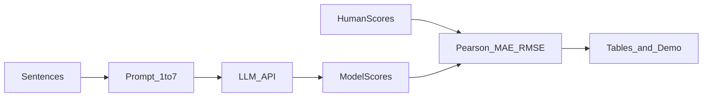

# 04 — Implementation steps

Mini-reproduction: **không train**. Chỉ prompt → lấy điểm → so human.

## Pipeline



## Bước 1 — Chuẩn bị data

Format mỗi dòng **JSONL**:

```json
{"sample_id": "rich_001", "sentence": "The photographer that the manager sent was helpful.", "human_score": 5.2, "structure": "relative_clause"}
```

Yêu cầu:

- `human_score` trong khoảng 1–7 (mean nếu nhiều annotator)
- Có field `structure` / `phenomenon` để phục vụ +1
- Tách `train/demo` không bắt buộc; với scope nhỏ dùng 1 file là đủ

Nguồn data (chọn 1, ưu tiên trên xuống):

1. Subset từ data paper / repo tác giả (nếu có)
2. Tự chọn 40–60 câu theo 2–3 cấu trúc + thu human ratings
3. Hybrid: một phần paper + vài câu tự thêm cho demo

## Bước 2 — Prompt (lấy từ paper, không invent)

Paper **đã cung cấp prompt** ở **Appendix A**:

- **Global prompt** (Figure 9): đa dạng cấu trúc, dùng chung nhiều dataset
- **Specific prompt** (Figure 10–12): theo từng dataset / cấu trúc

Khung instruction paper dùng (rút gọn):

```text
You will read sentences and judge how natural they sound.
Judge on a scale from 1 to 7 how natural/plausible the sentence sounds,
and explain yourself shortly.
All presented sentences will be grammatically correct.
Important: you are encouraged to use the whole scale.
Here are some examples:
...
The sentence:
{sentence}
The plausibility score is:
```

Việc của nhóm:

1. **Copy** global và/hoặc specific từ Appendix A (đủ examples theo score)
2. Chạy đúng tinh thần paper trước
3. Chỉ adapt nếu cần parse ổn định hơn (vd. yêu cầu thêm “answer with a number”) — **ghi rõ khác biệt** trên slide
4. Lưu: bản prompt cuối, temperature, model id, ngày chạy

Baseline khuyến nghị tuần này: **1 prompt global** (hoặc specific khớp subset đang dùng) là đủ cho 6đ.

## Bước 3 — Gọi LLM & parse

1. Đọc JSONL
2. Với mỗi câu: gửi prompt → nhận response
3. Parse số nguyên/thực trong [1, 7]; nếu fail → retry 1 lần hoặc đánh dấu `parse_error`
4. Ghi output:

```json
{"sample_id": "rich_001", "model": "gpt-4o", "model_score": 6, "raw_response": "6"}
```

Chạy 2 lần batch: **Model A** rồi **Model B** (cùng prompt, cùng data).

## Bước 4 — Tính metrics

Join theo `sample_id`:

| sample_id | human_score | model_a | model_b |
|---|---|---|---|

Tính (xem chi tiết [05_metrics_and_eval.md](05_metrics_and_eval.md)):

- Pearson *r* (human vs model)
- MAE, RMSE
- Coarse threshold metrics
- Fine-grained pairwise (nếu có cặp)

Export CSV + bảng markdown cho slide.

## Bước 5 — Demo

Tối thiểu CLI hoặc notebook:

```text
Input sentence → Model score (1–7) → (optional) human score nếu câu có trong data
```

Nên có:

- 4–6 câu demo cố định (đã cache điểm)
- 1–2 câu tự do (gọi API live nếu được)

## Cấu trúc thư mục code gợi ý (làm sau khi có plan)

```
doan/
  ... (docs)
code/   # hoặc doan/code/ — nhóm tự chọn
  data/
    sentences.jsonl
  prompts/
    baseline.txt
  outputs/
    model_a.jsonl
    model_b.jsonl
    metrics.csv
  scripts/
    run_llm.py
    compute_metrics.py
    demo.py
```

## Definition of Done (implement)

- [ ] Batch Model A chạy xong, không còn `parse_error` hàng loạt
- [ ] Batch Model B chạy xong trên **cùng** file data
- [ ] `metrics.csv` / bảng số khớp slide
- [ ] Demo chạy được trong rehearsal không cần sửa code nóng
