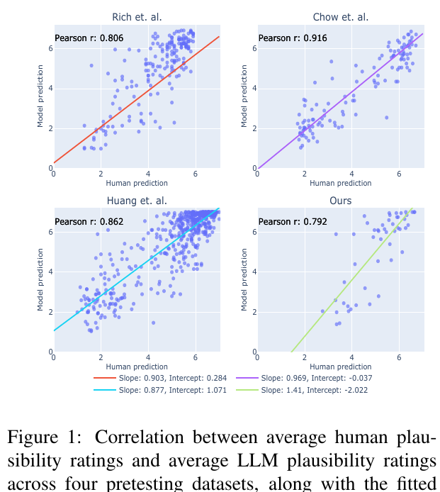
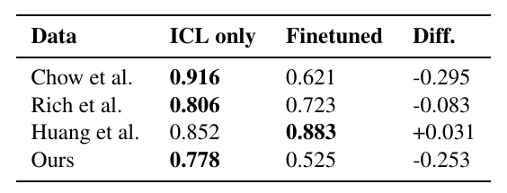

# Slide 3 — Paper nghiên cứu cái gì?

**Câu hỏi:** Paper hỏi gì? Setup ra sao?

**Paper:** Amouyal, Meltzer-Asscher & Berant — *Large Language Models for Psycholinguistic Plausibility Pretesting* (Findings of EACL 2024).

### Bài toán

Psycholinguistics cần **pretest plausibility** (người chấm thang **1–7**) để materials không bị lẫn bởi độ hợp lý — crowdsource **đắt / chậm**.

### Câu hỏi nghiên cứu (paper)

1. LM chấm plausibility có **tương quan** với người không (nhiều cấu trúc cú pháp)?
2. Correlation đó có đủ để **thay người** khi pretest không?

### Setup (paper §2)

| Thành phần | Paper dùng |
| --- | --- |
| **Data** | **4 bộ:** Chow / Rich / Huang / Ours (~**853** câu) — Likert người sẵn |
| **Model** | Closed: GPT-4, GPT-3.5, InstructGPT · Open: LLaMA, Alpaca, Vicuna, Falcon, MPT, … |
| **Prompt** | Global vs Specific; có / không few-shot; scale **1–7** |
| **Metric** | Pearson **r** với mean người (+ split-half người ≈ upper bound) |

**Câu nói:** *Paper không hỏi “LLM hiểu ngôn ngữ?” — hỏi LLM có thay được crowdsource khi pretest materials không.*

---

## Slide 4 — Paper thực nghiệm hướng nào? Kết quả ra sao?

**Câu hỏi:** Paper thử những hướng nào? Kết luận chính là gì?

| Hướng | Paper làm gì | Kết quả chính |
| --- | --- | --- |
| **Zero/few-shot LLM rating** | Prompt 1–7, sample nhiều lần → mean | **GPT-4** r cao nhất hầu hết bộ (Chow Spec **0.916**, Rich **0.806**, Huang **0.852**, Ours **0.778**); LM khác ổn cấu trúc thường, yếu cấu trúc hiếm (Chow) |
| **Prompt design** | Global vs Specific; có vs không examples | Specific + examples thường **tốt hơn**; bỏ examples → r giảm (Fig. 3) |
| **Instruction/chat FT (open)** | So base LLaMA vs Alpaca / Vicuna… | Chat/instruction FT **cải thiện** likeness so base cùng size |
| **Fine-tune GPT-4 trên label** | FT trên 3 bộ, test hold-out 1 bộ (Table 3) | **Không có lợi** khi chuyển domain/cấu trúc (Chow **−0.30**, Ours **−0.25**); Huang +0.03 nhẹ |
| **Thay người? Coarse vs fine** | §4: lọc implausible (P–R); phân biệt cặp gần mean | **Coarse OK** (lọc câu vô lý tốt); **fine-grained chưa** — kể cả GPT-4 discriminative power chưa đủ thay t-test / kiểm soát cặp gần nhau |

**Kết luận paper (1 dòng):** GPT-4 bám người tốt trên nhiều cấu trúc → dùng được phán đoán **thô**; **chưa** thay người khi cần phán đoán **tinh**.

### Visual từ paper

**Fig. 1 — Correlation human vs LM (4 dataset)**



**Table 3 — Fine-tune GPT-4 vs ICL (hold-out)**



**Câu nói:** *Paper đã thử prompt, zoo LM, và cả fine-tune GPT-4 — fine-tune không cứu được transfer; bottleneck là fine-grained, không phải thiếu GPT-4.*

---

## Slide 5 — Dataset & phạm vi

### Full data paper (4 bộ — paper đã chạy GPT-4 trên cả bốn)

| Bộ          | # câu  | Tập trung                                                 |
| ----------- | ------ | --------------------------------------------------------- |
| Chow (Tal)  | 120    | Câu hỏi tân ngữ lồng trong mệnh đề (cặp hợp lý / vô lý)   |
| Rich (Matt) | 192    | Câu bị động (hợp lý / vô lý)                              |
| Huang (SAP) | 491    | Câu đa nghĩa kiểu garden-path / nhiều cấu trúc cú pháp    |
| **Ours**    | **50** | Câu đơn giản (chủ–động–tân); chỉ đổi tân ngữ có kiểm soát |

Tổng ≈ 853 câu.

### Nhóm chỉ thực nghiệm trên bộ Ours

1. **Thiết kế:** tác giả **tự tạo** cho thí nghiệm *nhiễu do tương đồng danh ngữ* (similarity-based interference) + đánh giá LLM pretest; kiểm soát đổi object → dễ phân tích lỗi
2. **Fair compare:** full 50 câu; so human / GPT-4 paper / model nhóm **cùng Ours**
3. **Chi phí:** 50 × 20 sample × nhiều model × 2+ MODE đã **\~\$15**; nếu chạy cả 4 bộ (\~853 câu, gấp \~17 lần Ours) ước **vài trăm đô** → không khả thi budget đồ án

**Câu nói:** *Chỉ full Ours: bộ tác giả tự thiết kế + cùng baseline GPT-4 paper; chi phí là một lý do — \~\~15\$ cho 50 câu, cả bốn bộ (\~\~853 câu) vài trăm đô.*

---

## Slide 5b — Dataset Ours: 5 điều kiện object

**Câu hỏi:** Ours là gì? `all` / `global` / `animate` / `plural` / `name` nghĩa là gì? Sao lại 4 biến thể đó?

### Ours là gì?

| | |
| --- | --- |
| **Paper** | Bộ *Ours* (§2.1) — 50 câu **plausible**, cấu trúc đơn giản (S–V–O) |
| **Repo** | `mem_enc` — **10 khung × 5 biến thể** = 50 câu; ~**40** người chấm / câu |
| **Mục đích tạo** | Materials cho thí nghiệm tương lai *similarity-based interference* (nhiễu do NP giống nhau); paper dùng để **đánh giá LLM pretest** |

**Cấu trúc:** cùng 1 khung câu, **chỉ đổi object-NP** theo 5 hậu tố `sample_id` (vd. `s1_all` … `s1_name`).  
→ Có **4 cặp** so với baseline `all` (khớp pretest fine-grained / t-test §4.4).

### 5 điều kiện (ví dụ khung *The nurse fetched …*)

| Cond | Object | Ý thao tác | Ví dụ |
| --- | --- | --- | --- |
| **`all`** | baseline | Object “khớp vai” nhất | *…the patient.* |
| **`global`** | vẫn người, **lệch vai** | Cùng ngữ cảnh nhưng vai khác | *…the intern.* |
| **`animate`** | đổi **hữu sinh ↔ vô tri** | Thường → đồ vật (nhãn = loại thao tác, không = “object hữu sinh”) | *…the file.* |
| **`plural`** | **số nhiều** | Cùng ý, đổi số | *…the interns.* |
| **`name`** | **tên riêng** | Thay *the …* bằng tên | *…Matt.* |

**Lưu ý:** `global` ở đây = condition object — **≠** “global prompt” (§2.3).

### Tại sao có 4 biến thể (+ `all`)?

| Biết từ paper / data | Không biết từ paper |
| --- | --- |
| Cần nhiều biến thể để pretest **cùng mức plausibility** trước thí nghiệm similarity NP (animacy / giống nhau → nhiễu đọc) | **Vì sao đúng 4 loại** global / animate / plural / name (không phải thao tác khác) |
| 40 cặp = 10 khung × 4 so với `all` → phục vụ so cặp / t-test (§4.4) | Paper **không đặt tên** các hậu tố; tên đến từ `sample_id` trong data |

**Khi phân tích:** tách theo condition để hỏi LLM giỏi/kém ở **kiểu đổi object** nào — không phải “chủ đề tin tức”.

**Câu nói:** *Ours = 10 khung × 5 cách đổi tân ngữ; biết vì sao có nhiều biến thể (pretest / similarity), nhưng paper không giải thích vì sao đúng bốn loại global–animate–plural–name.*

---

## Slide 6 — Thiết kế thực nghiệm

```
Ours 50 câu  →  Prompt paper (1–7)  →  LLM ×20  →  model_mean
                      ↓
              so human_mean (+ GPT-4 paper)
                      ↓
         Metric: Pearson r (chính), MAE (phụ)
```

| Thành phần   | Thiết kế nhóm                                                                                                           |
| ------------ | ----------------------------------------------------------------------------------------------------------------------- |
| **Data**     | Full Ours (50 câu), human paper                                                                                         |
| **Baseline** | GPT-4 paper (`gpt4_mean`) — điểm tác giả đã chạy trên cùng 50 câu Ours                                                  |
| **Prompt**   | Bám paper: few-shot, scale 1–7                                                                                          |
| **Mode**     | ORIG: Base pipeline (Như paper), S: Schema (Áp dụng Json Schema), T: Thinking (Áp dụng reasoning), ST: S+T (S+Thinking) |
| **Resample** | 20 lần / câu → `model_mean`                                                                                             |
| **Đo gì?**   | Giống người bao nhiêu (r, MAE); Thinking/schema có giúp cải thiện kết quả không; \$/câu                                 |

**Câu nói:** *Cùng data + prompt paper; chỉ đổi model và cách gọi (MODE) — so điểm với người và GPT-4 paper.*

---

## Slide 7 — Model, prompt & ví dụ I/O

### Model thực nghiệm (Ours, đủ 50 câu)

| Model (API / slug)             | Là gì?                                          | MODE                      |
| ------------------------------ | ----------------------------------------------- | ------------------------- |
| **gpt-5.6-luna**               | OpenAI GPT-5.6 (bản Luna)                       | ORIG, T                   |
| **gpt-5.6-sol**                | OpenAI GPT-5.6 (bản Sol)                        | ORIG, T                   |
| **moonshotai/kimi-k3**         | Kimi K3 (Moonshot)                              | ORIG, T                   |
| **z-ai/glm-5.2**               | GLM-5.2 (Zhipu / Z.AI)                          | ORIG, T                   |
| **google/gemma-4-31b-it**      | Gemma 4 31B instruct (Google)                   | ORIG, S, T, ST            |
| **google/gemma-3-12b-it**      | Gemma 3 12B instruct (Google)                   | ORIG, S                   |
| **deepseek/deepseek-v4-flash** | DeepSeek V4 Flash                               | ORIG, S, T, ST            |
| **openai/gpt-4.1-mini**        | GPT-4.1 Mini (OpenAI) — **≠** GPT-4 paper       | ORIG                      |
| **google/gemini-3.6-flash**    | Gemini 3.6 Flash (Google)                       | T                         |
| **GPT-4 (paper)**              | GPT-4 của tác giả paper trên Ours (`gpt4_mean`) | baseline — không chạy lại |

**MODE:** ORIG = free-text · S = JSON schema · T = thinking · ST = schema+thinking

### Cấu trúc prompt (bám paper, `num_ex=3`)

1. **System:** chấm tự nhiên/hợp lý **1–7**; câu đúng ngữ pháp; trả lời bắt đầu `The naturalness score is`
2. **Few-shot:** vài cặp câu + điểm mẫu (vd. *scolded the shoe* → 1; *scolded the troublemaker* → 7)
3. **User:** câu cần chấm

### Ví dụ 1 câu (`s1_all`)

**Input (user):**

```
The nurse fetched the patient.
```

**Output (ORIG, ví dụ glm):**

```
The naturalness score is 4 (it is plausible that a nurse would fetch a patient…)
```

→ parse `score = 4` · lặp **20 lần**/câu → lấy `model_mean` so `human_mean` (≈6.27)

## **Câu nói:** *Cùng prompt paper; khác ở model và MODE — mỗi câu gọi 20 lần rồi lấy trung bình.*

## Slide 8 — Kết quả thực nghiệm (Ours, 50 câu)

*Metric: Pearson r với* *`human_mean`* *(cao = giống người hơn).*

### Xếp hạng nhanh

| Hạng | Model × MODE                 | r           |
| ---- | ---------------------------- | ----------- |
| 1    | GPT-5.6 Luna **T**           | **0.785**   |
| 2    | GPT-5.6 Luna ORIG            | 0.778       |
| 3    | **GPT-4 (paper)**            | **0.755**   |
| …    | Kimi / Sol / GLM / Gemma…    | 0.49–0.73   |
| thấp | Gemma-4 ORIG / DeepSeek ORIG | 0.49 / 0.55 |

**Visual:** `results/analysis/M1_agreement_vs_gpt4paper.png`

### Trả lời 4 RQ

| RQ                     | Kết quả                                                                                              |
| ---------------------- | ---------------------------------------------------------------------------------------------------- |
| 1. Paper còn đúng?     | **Có (hướng).** Mean bám người tốt; variance LM thấp (collapse \~91%) → coarse OK, fine-grained chưa |
| 2. Lớn/mới hơn nhỏ/cũ? | **Không chắc.** DeepSeek/Gemma-4 ORIG **thua** Gemma-3-12B (0.55/0.49 vs 0.64)                       |
| 3. Thinking giúp?      | **Thường có.** 5/6 model: T ≥ ORIG. Ngoại lệ Sol (−0.03)                                             |
| 4. AI rẻ hơn người?    | **Có.** Rẻ hơn ước crowdsource (\~\$3.20/câu) **43×–4165×**. Pareto: Luna                            |

### Điểm phụ

- Điều kiện: dễ `**animate**` (r≈0.81) · khó `**global**` (r≈0.49)
- Schema thường **hại** likeness (DeepSeek S−ORIG Δr≈−0.14)
- GPT-4 paper: bias thấp (+0.06); Luna thắng r nhưng bơm điểm hơn (+0.31)

**Câu nói:** *Trên Ours: kết luận paper vẫn đúng hướng; model mới không tự thắng; Thinking thường giúp; API rẻ hơn crowdsource rất nhiều.*

---

## Slide 9 — Theo điều kiện câu (heatmap)

**Visual:** `results/analysis/M2_condition_heatmap.png`

### Nhìn chung

| Condition | Mean r (zoo) | GPT-4 paper | Ý        |
| --------- | ------------ | ----------- | -------- |
| `animate` | **0.81**     | 0.85        | Dễ nhất  |
| `name`    | 0.70         | 0.85        |          |
| `plural`  | 0.65         | 0.73        |          |
| `all`     | 0.64         | 0.75        |          |
| `global`  | **0.49**     | 0.62        | Khó nhất |

- **Thứ tự độ khó giống GPT-4:** `animate` dễ · `global` khó — pattern zoo ≈ paper.
- **Thứ tự model không giống GPT-4 trên mọi cột:** ai #1 overall không phải #1 mọi condition.
  - Luna gần paper nhất (ổn qua 5 cột; `global` vẫn \~0.70).
  - Kimi lệch: mạnh `plural`/`animate`, yếu `global`/`name`.
  - Gemma-4 ORIG lệch nặng: `animate`/`name` cao nhưng `**global` ≈ 0\*\* (thậm chí âm) → kéo r tổng xuống.

### Kết luận slide

1. **Lỗi không đều:** LLM giống người tốt ở đổi vô tri (`animate`), kém khi object “gần ngữ cảnh nhưng lệch vai” (`global`).
2. **Khớp paper về điểm yếu:** GPT-4 cũng yếu nhất ở `global` — không phải lỗi riêng model mới.
3. **SOTA overall ≠ ổn mọi kiểu câu:** thứ tự model đổi theo condition; vài model (vd. Gemma-4 ORIG) lệch nặng 1 cột → r tổng thấp dù chỗ khác ổn.

**Câu nói:** *Kết luận: likeness phụ thuộc kiểu thao tác object —* *`global`* *là điểm yếu chung; model mới không tự khắc phục, và ranking tổng không đảm bảo đều trên mọi condition.*

---

## Slide 10 — Case minh họa (lỗi cụ thể)

**Câu hỏi:** Lỗi theo condition trông thế nào trên câu thật?

### Khung `s1` (5 điều kiện) — Human vs GPT-4 paper vs Luna ORIG

| Cond      | Câu                              | Human | GPT-4 paper | Luna ORIG |
| --------- | -------------------------------- | ----- | ----------- | --------- |
| `all`     | *The nurse fetched the patient.* | 6.3   | 6.5         | 6.1       |
| `global`  | *…the intern.*                   | 5.1   | 5.7         | 5.0       |
| `animate` | *…the file.*                     | 6.2   | 6.2         | 5.8       |
| `plural`  | *…the interns.*                  | 5.5   | 6.1         | 5.1       |
| `name`    | *…Matt.*                         | 4.9   | 5.4         | 5.5       |

→ Trực quan: Luna gần human hơn GPT-4 ở vài ô (`global`, `plural`); GPT-4 gần hơn ở `animate`; `name` cả hai **cao hơn** human.

### Case 1 — Residual lớn (`s3_global`)

*The art dealer brought the artist.*

|              | Điểm                                     |
| ------------ | ---------------------------------------- |
| Human        | **≈3.3** (nhiều người thấp — “lệch vai”) |
| Gemma-3 ORIG | **≈6.8**                                 |
| GPT-4 paper  | ≈5.3                                     |

→ Model **bơm** / không bắt nuance.

### Case 2 — Disagreement cao (`s4_all`)

*The dean observed the scientist.*

|           |                                          |
| --------- | ---------------------------------------- |
| Human     | mean≈4.1 · **std≈2.08** (có 1 cũng có 7) |
| Luna ORIG | mean≈5.4 · **std≈0.49**                  |

→ Model **phẳng** — không tái hiện bất đồng người.

**Visual:** `M3_case_histograms.png` (gộp) · `M3_histograms/*.png` (từng câu×model; model scale → n=20)

**Kết luận slide:** Không chỉ báo r — chỉ ra *sai kiểu nào* (`global` bơm điểm; câu tranh cãi thì collapse). Đó là phần **+1đ**.

**Câu nói:** *Ví dụ cụ thể: câu lệch vai người cho thấp, model cho 6–7; câu người tranh cãi, model điểm gần như nhau.*

---

## Slide 11 — Giải thích nghịch lý: frontier thua model nhỏ hơn?

**Nghịch lý (quan sát nhóm trên Ours):** vài model lớn/mới có Pearson r với human **thấp hơn** model nhỏ hơn (cùng Likert 1–7, cùng prompt).\
→ Không phải “model lớn dốt hơn” — Đây là một số dẫn chững mà nhóm tìm được từ các paper khác khi tiềm hiểu nguyên nhân của nghịch lý này.

| Vì sao frontier có thể thua?    | Bằng chứng từ paper                                                                                                                                      | Chú thích                                              |
| ------------------------------- | -------------------------------------------------------------------------------------------------------------------------------------------------------- | ------------------------------------------------------ |
| **1. Giống người ≠ điểm SOTA**  | [2025.findings-naacl.376](https://aclanthology.org/2025.findings-naacl.376/): chỉnh calibration xong, model nhỏ có thể **ngang** model lớn trên judgment | Lớn hơn không đảm bảo r cao hơn với crowdsource        |
| **2. Bắt trả số 1–7 ngay**      | arXiv:2510.08338: hỏi thẳng “cho điểm mấy?” → điểm **dồn vài mức** + thường **cao hơn người**                                                            | Model “mạnh” vẫn bơm/dồn → Pearson với crowdsource xấu |
| **3. Likert dễ bias**           | [2025.findings-acl.480](https://aclanthology.org/2025.findings-acl.480/): Likert dễ bias; model lớn **không tự hết** bias đó                             | Frontier vẫn lệch systematic vs người                  |
| **4. Scale ≠ bắt disagreement** | [2026.eacl-long.3](https://aclanthology.org/2026.eacl-long.3/): scale giúp nhãn đa số nhiều hơn HighVar                                                  | Pretest cần bám mean crowdsource; lớn hơn không đủ     |

**Nguồn paper (đầy đủ)**

1. NAACL’25 — *Aligning Black-box LMs with Human Judgments* · [2025.findings-naacl.376](https://aclanthology.org/2025.findings-naacl.376/)
2. arXiv:2510.08338 — SSR / purchase-intent Likert (ép chọn số → phân bố hẹp, lệch)
3. ACL’25 — *Decoding LLM Personality Measurement: Forced-Choice vs. Likert* · [2025.findings-acl.480](https://aclanthology.org/2025.findings-acl.480/)
4. EACL’26 — *Can Reasoning Help LLMs Capture Human Annotator Disagreement?* · [2026.eacl-long.3](https://aclanthology.org/2026.eacl-long.3/)

**Chú thích thuật ngữ**

- **Likert** — thang điểm người **1–7** (1 = rất vô lý, 7 = rất tự nhiên); crowdsource chấm rồi lấy trung bình
- **Ép Likert số** — bắt model **trả luôn một con số 1–7** (không viết giải thích rồi mới map sang điểm)
- **Hẹp** — điểm model chỉ rơi vào **vài mức** (vd. toàn 5–6), ít trải 1–7 như người
- **Lệch** — trung bình model **lệch phía** crowdsource (thường **cao hơn** / “bơm”)
- **Scale** (ở đây) — **phóng to model** (thêm tham số / model lớn hơn), **không** phải “thang điểm”
- **Điểm SOTA** — hạng cao trên benchmark nóng (coding, exam, arena…); **≠** Pearson r với điểm Likert người

---

## Slide 12 — Chi phí & Pareto

**Câu hỏi (RQ4):** \$/câu API có rẻ hơn ước crowdsource? Ai Pareto (r cao, \$ thấp)?

### Cách so

| Bên                   | Cách tính                                                        |          \$/câu |
| --------------------- | ---------------------------------------------------------------- | --------------: |
| **Người (ước slide)** | \$0.08/rating × **40** annotators                                |      **\$3.20** |
| **API**               | token log × `configs/pricing.yaml` (as\_of 2026-07-26), post-hoc | từng model×MODE |

*Ước crowdsource cho slide —* ***không*** *phải hóa đơn paper.*\
**Nguồn \$0.08:** ballpark thị trường — [Prolific](https://www.prolific.com/pricing) (\$8–12/giờ → \~\$0.04–0.10/rating nếu 20–30s; +fee \~33–43%); [MTurk pricing](https://requester.mturk.com/pricing) (HIT ngắn thường \~\$0.01–0.05 + fee 20–40%); Scale Rapid \~\$0.05/unit (self-serve). Chi tiết: `configs/pricing.yaml` → `human.notes`.

### Kết quả (ORIG / T, đủ 50 câu)

**Có** — mọi run rẻ hơn ước người khoảng **43×–4165×**.

| Điểm neo         | Model × MODE         |         r |       \$/câu | × rẻ hơn human |
| ---------------- | -------------------- | --------: | -----------: | -------------: |
| **r cao nhất**   | Luna **T**           | **0.785** |      \$0.027 |         \~120× |
| **Pareto tốt**   | Luna **ORIG**        |     0.778 |      \$0.016 |         \~202× |
| **Pareto trung** | Kimi **ORIG**        |     0.692 |      \$0.012 |         \~265× |
| **Rẻ nhất**      | Gemma-3-12B **ORIG** |     0.640 | **\$0.0008** |    **\~4165×** |

### Đọc Pareto

- Góc **trên–trái** = tốt: likeness cao, giá thấp.
- Phân cụm: **frontier API** (GPT-5.6, Gemini, Kimi, GLM…) thường **r cao hơn**; **open-source nhỏ** (Gemma-3/4, …) **\$/câu thấp hơn**.
- Trade-off rõ: muốn max likeness → frontier; muốn min chi phí → open-source (API rẻ hoặc **tự host**).

### Kết luận slide

1. AI **rẻ hơn** ước crowdsource rất nhiều (không chỉ nhanh hơn).
2. Không có 1 model “tốt nhất mọi tiêu chí” — trade-off **chất lượng vs chi phí**.
3. Gợi ý pretest: cần **chất lượng** → frontier (GPT-5.6, Gemini 3.6, Kimi-K3, GLM-5.2…); cần **rẻ** → open-source (Gemma-3/4, Qwen…) **tự host**.

**Câu nói:** *API đã rẻ hơn crowdsource hàng chục đến hàng nghìn lần — muốn chất lượng thì dùng frontier; muốn rẻ thì dùng open-source tự host.*

---

## Slide 13 — Kết luận

Trả lời lại **4 câu hỏi nghiên cứu** (Ours, zoo 2025–26):

### 1. Model mới/mạnh có cải thiện kết luận paper không?

**Có và không.**

|           |                                                                                                                                                                                                                  |
| --------- | ---------------------------------------------------------------------------------------------------------------------------------------------------------------------------------------------------------------- |
| **Có**    | Một số model **vượt GPT-4 paper** về Pearson r (vd. Luna T ≈**0.785** vs paper ≈**0.755**) — cải thiện **không lớn**, nhưng là tín hiệu mảng Likert pretest vẫn tiến; **1–2–3 năm nữa nên kiểm chứng lại**.      |
| **Không** | Phần lớn kết quả **tiệm cận** paper: mean bám người khá, **variance vẫn collapse** (\~91%). → LLM **thay được lọc thô**, **chưa thay t-test cặp câu**; vẫn **hỗ trợ tốt** vì giá đã rất rẻ / có thể **tự host**. |

### 2. Frontier có tốt hơn open-source trên bài này không?

**Không chắc / không tự nhiên hơn.**\
Frontier đang train theo hướng **SOTA** (khoa học, coding, long-term task) ≠ bám Likert crowdsource. Model **nhỏ / open-source** nếu (hoặc khi) được huấn luyện / calibrate **chuyên** cho rating vẫn có thể **ngang hoặc hơn** trên likeness (vd. Gemma-3 ORIG r≈0.64 > DeepSeek/Gemma-4 ORIG).

### 3. Dùng AI đã đủ rẻ, đủ tiện chưa?

**Có — rất rẻ, rất nhanh.**\
API **~~43×–4165×~~** ~~rẻ hơn ước crowdsource (~~\$3.20/câu). Hỗ trợ annotator ở nhiều khâu: **tạo data**, **lọc / phân loại thô**, pretest nhanh trước khi chạy người.

### 4. Thinking (reasoning) có cải thiện kết quả không?

**Có (thường trên r)**, nhưng **chi phí tăng** vì sinh thêm nhiều token.

- **Sol:** phía output \~4× (1 câu → vài câu reasoning); tổng \$/câu chỉ \~**+46%** vì **input vẫn chiếm lớn** (prompt few-shot cố định).
- Model viết thinking dài (GLM/Gemma): token output-side tăng **hàng chục lần** → \$ **đột biến**.

**Câu nói (mục 4):** *Thinking thường giúp r, nhưng đắt hơn vì reasoning = thêm output token — ORIG một câu, T cả đoạn suy luận; Sol output-side \~4×, GLM có thể \~60×.*

**Câu nói (cả slide):** *Kết luận paper vẫn đúng (lọc thô được, fine chưa); frontier không tự thắng open-source trên Likert; AI đủ rẻ hỗ trợ annotator; Thinking hữu ích nhưng trả bằng output token.*

---

## Slide 14 — Hạn chế

**Câu hỏi:** Giới hạn gì cần nói thẳng?

| Hạn chế                   | Chi tiết                                                                                                                                        |
| ------------------------- | ----------------------------------------------------------------------------------------------------------------------------------------------- |
| **Chỉ 1 / 4 dataset**     | Chỉ **Ours** (full 50 câu) — không chạy Tal / Matt / SAP; không replicate Figure 4–5 coarse của paper                                           |
| **Chưa phủ hết frontier** | Không chạy thêm model như Claude (Fable), Mythos… — **chi phí quá cao**; zoo đã có model **tương đương hạng** (GPT-5.6, GLM-5.2, Kimi, Gemini…) |
| **Giả thuyết chưa chứng** | “Chat-rating vs coding-agent” / calibration era = **giả thuyết** từ bias/MAE — chưa thí nghiệm mixture / fine-tune chuyên Likert                |
| **n = 50 nhỏ**            | Một số Δr (vd. Sol T vs ORIG) có thể nhiễu — không overclaim ý nghĩa thống kê                                                                   |

**Câu nói:** *Hạn chế chính: một dataset và chưa phủ hết frontier vì budget — nhưng trên Ours chúng em chạy đủ 50 câu, so GPT-4 paper, và phân tích lỗi có số.*

---

## Slide 15 — Tài liệu tham khảo

1. **Amouyal, S. J., Meltzer-Asscher, A., & Berant, J.** (2024). *Large Language Models for Psycholinguistic Plausibility Pretesting.* Findings of EACL 2024.  
   https://aclanthology.org/2024.findings-eacl.12/ · arXiv:2402.05455 · Code: https://github.com/samsam3232/llm_pretesting

2. **Ness, T., & Meltzer-Asscher, A.** (2019). *(Similarity-based interference — trích trong paper chính.)*

3. **Aligning Black-box Language Models with Human Judgments.** Findings of NAACL 2025.  
   https://aclanthology.org/2025.findings-naacl.376/

4. **SSR / purchase-intent Likert** (ép chọn số → phân bố hẹp, lệch). arXiv:2510.08338.  
   https://arxiv.org/abs/2510.08338

5. **Decoding LLM Personality Measurement: Forced-Choice vs. Likert.** Findings of ACL 2025.  
   https://aclanthology.org/2025.findings-acl.480/

6. **Can Reasoning Help LLMs Capture Human Annotator Disagreement?** EACL 2026 (long).  
   https://aclanthology.org/2026.eacl-long.3/

7. **Prolific pricing** (ước chi phí crowdsource cho slide). https://www.prolific.com/pricing

8. **Amazon Mechanical Turk pricing** (ước chi phí crowdsource cho slide). https://requester.mturk.com/pricing

9. Zoo model 2025–26 trên **Ours / mem_enc** (50 câu); baseline GPT-4 paper (`gpt4_mean`).

10. Kết quả & phân tích nhóm: `results/SUMMARY.md`, `results/analysis/report.md`.

**Câu nói:** *Paper neo là Amouyal et al. EACL 2024; thêm vài paper 2025–26 để giải thích nghịch lý frontier; chi phí người là ước thị trường.*
