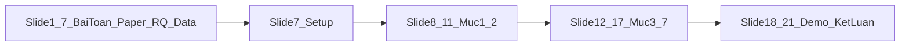

# Bố cục slide thuyết trình (\~15 phút)

> Outline dùng trực tiếp khi làm PowerPoint/Google Slides.\
> Nguồn số: [`../results/analysis/report.md`](../results/analysis/report.md), [`../results/analysis/TOM_TAT.md`](../results/analysis/TOM_TAT.md).\
> Phạm vi: **full Ours / mem\_enc** (50 câu); chi phí human là ước slide ($0.08×40 ≈ $3.20/câu), không phải hóa đơn paper.

---

## Phần meta (không lên slide)

### Thời lượng & phân công

| Vai trò       |  Phút | Việc                                             |
| ------------- | ----: | ------------------------------------------------ |
| **Speaker A** |   0–6 | Giới thiệu, bài toán, paper, dataset Ours, setup |
| **Speaker B** |  6–13 | Kết quả Mục 1–7, phân tích lỗi, demo             |
| **A hoặc B**  | 13–15 | Kết luận, hạn chế, Q\&A                          |

Chi tiết vai trò: [`../docs/07_demo_and_slides.md`](../docs/07_demo_and_slides.md).

### Map phút ↔ slide

|  Phút | Nội dung                              | Slide | Mục phân tích |
| ----: | ------------------------------------- | ----: | ------------- |
|   0–6 | Bài toán, paper, RQ, dataset, setup   |   1–7 | Intro         |
|   6–9 | Kết quả tổng + theo điều kiện         |  8–11 | 1–2           |
|  9–12 | Disagreement, schema, frontier, GPT-4 | 12–16 | 3–6           |
| 12–13 | Chi phí                               |    17 | 7             |
| 13–15 | Demo + kết luận                       | 18–21 | Đúc kết       |

### Artifact chính (đặt trong `results/analysis/`)

| Slide | File                                                                                      |
| ----- | ----------------------------------------------------------------------------------------- |
| Mục 1 | `M1_agreement_vs_gpt4paper.png`, `E_orig_ranking_with_gpt4.png`, `M1_unified_ranking.csv` |
| Mục 2 | `M2_condition_heatmap.png`, `M2_by_condition.csv`                                         |
| Mục 3 | `M3_case_histograms.png`, `M3_dispersion.csv`                                             |
| Mục 4 | `D_schema_deltas.csv`                                                                     |
| Mục 5 | `M5_paradox_table.csv`, `M5_calibration_bias_slope.png`                                   |
| Mục 6 | `M6_calibration_compare.png`                                                              |
| Mục 7 | `M7_pareto_quality_cost.png` (hoặc `F_pareto_quality_cost.png`), `M7_cost_table.csv`      |

> Preview ảnh bên dưới dùng path tương đối từ `doan/slide/slide_outline.md` → `../results/analysis/…` (cùng file trong `report.md`).

---

## Slide 1 — Title

**Câu hỏi:** Đồ án này làm gì, paper nào, nhóm làm gì thêm?

**Cách trả lời:**

- Tiêu đề: *Large Language Models for Psycholinguistic Plausibility Pretesting* — mini-reproduce & mở rộng
- Paper: Amouyal, Meltzer-Asscher & Berant — **Findings of EACL 2024** (arXiv:2402.05455)
- Nhóm: đánh giá lại **full** bộ *Ours* của paper (50 câu; tên file repo: `mem_enc`) với zoo model **2025–26** + ablation MODE (ORIG / S / T / ST)
- **Visual:** logo CS2202 + tên nhóm + 1 dòng “+3 model mới, +1 phân tích lỗi”

**Câu nói:** *Chúng em reproduce paper EACL 2024 trên full dataset Ours (mem\_enc — 50 câu), rồi hỏi model mới có thay đổi kết luận không.*

---

## Slide 2 — Bài toán pretest plausibility

**Câu hỏi:** Tại sao cần pretest? LLM có thể thay người không?

**Cách trả lời:**

- Trong psycholinguistics, trước thí nghiệm đọc hiểu phải **pretest** độ hợp lý (*plausibility*) của câu — người chấm scale **1–7**
- Crowdsource: tốn thời gian, tốn chi phí (\~40 người/câu), khó lặp nhanh khi chỉnh materials
- **Câu hỏi paper:** LLM có thể thay người ở bước pretest này không?
- **Visual:** sơ đồ pipeline: *viết câu → pretest plausibility → thí nghiệm đọc hiểu*

**Câu nói:** *Pretest là bước bắt buộc trước khi đưa câu vào thí nghiệm — paper hỏi LLM có làm được bước đó không.*

---

## Slide 3 — Paper nghiên cứu cái gì?

**Nguồn chính:** [`slide.md`](slide.md) Slide 3 · paper EACL Findings 2024.

**Câu hỏi:** Paper hỏi gì? Setup ra sao?

**Cách trả lời:**

- **Bài toán:** pretest plausibility 1–7 (crowdsource đắt/chậm) trước thí nghiệm psycholinguistics
- **RQ paper:** (1) LM có tương quan với người trên nhiều cấu trúc? (2) Đủ để **thay người** pretest không?
- **Setup §2:** 4 dataset (~853 câu); GPT-4/3.5/InstructGPT + open LMs; Global/Specific ± examples; metric Pearson r (+ split-half)
- **Không lẫn RQ nhóm** — slide này chỉ paper

**Câu nói:** *Paper không hỏi “LLM hiểu ngôn ngữ?” — hỏi LLM có thay được crowdsource khi pretest materials không.*

---

## Slide 4 — Paper thực nghiệm hướng nào? Kết quả ra sao?

**Nguồn chính:** [`slide.md`](slide.md) Slide 4.

**Câu hỏi:** Paper thử những hướng nào? Kết luận chính?

**Cách trả lời (bảng hướng → kết quả):**

| Hướng | Kết quả chính |
| --- | --- |
| Few-shot LLM rating | GPT-4 r cao (Chow Spec 0.916 … Ours 0.778); LM khác yếu cấu trúc hiếm |
| Prompt design | Specific + examples tốt hơn; bỏ examples → r giảm |
| Chat/instruction FT (open) | Alpaca/Vicuna > base LLaMA cùng size |
| Fine-tune GPT-4 (Table 3) | **Không có lợi** transfer (Chow −0.30, Ours −0.25) |
| Coarse vs fine (§4) | **Coarse OK**; **fine-grained chưa** (kể cả GPT-4) |

**Kết luận paper:** GPT-4 dùng được phán đoán thô; chưa thay người khi cần phán đoán tinh.

**Câu nói:** *Paper đã thử prompt, zoo LM, và fine-tune GPT-4 — fine-tune không cứu transfer; bottleneck là fine-grained.*

**Visual:** Fig. 1 · Table 3

---

## Slide 4b — Research question (nhóm)

**Câu hỏi:** Câu hỏi nghiên cứu của đề tài (nhóm) là gì?

**Cách trả lời (lên slide — bullet ngắn + diễn giải dưới mỗi bullet):**

1. **Kết luận paper còn đúng khi model lớn/mới vượt trội không?**
   - *Diễn giải:* Paper EACL 2024 (GPT-4/3.5) nói coarse OK, fine-grained chưa. Zoo 2025–26 (luna, sol, kimi, gemma…) có **phá** kết luận đó không?
2. **Model lớn / mới có tốt hơn model nhỏ / cũ không?**
   - *Diễn giải:* “Tốt hơn” = **giống người hơn** (Pearson r / MAE với `human_mean`), không phải điểm coding/reasoning. Frontier có thua Gemma-3-12B không?
3. **Thinking có giúp model giống người hơn không?**
   - *Diễn giải:* So **T vs ORIG** trên cùng model: bật reasoning có tăng likeness với crowdsource không?
4. **Dùng AI có rẻ và nhanh hơn người không?**
   - *Diễn giải:* So **$/câu** (và latency nếu có) của API với ước crowdsource (~$3.20/câu); ai Pareto (r cao, $ thấp)?

**Một dòng tóm (footer slide):**

> *Paper còn đứng? Lớn hơn có giống người hơn? Thinking có giúp? AI có rẻ/nhanh hơn người?*

**Visual:** 4 ô / 4 số lớn; mỗi ô 1 RQ + 1 dòng diễn giải

**Câu nói:** *Bốn câu hỏi dẫn cả thí nghiệm — reproduce paper trên model mới, rồi trả lời từng cái bằng số.*

**Map sang kết quả:** RQ1→Mục 1+3 · RQ2→Mục 5–6 · RQ3→Mục 1/4 · RQ4→Mục 7

---

## Slide 5 — Dataset của paper & đặc điểm

**Câu hỏi:** Data thí nghiệm lấy từ đâu? File `mem_enc_human_and_gpt` là gì? Có tự chế không? Chạy giống paper không?

**Cách trả lời:**

### Chúng ta thực nghiệm trên tập nào?

|                                      |                                                               |
| ------------------------------------ | ------------------------------------------------------------- |
| **Tên trong paper**                  | *Ours* (§2.1, Table 1)                                        |
| **Tên trong repo paper**             | `mem_enc` / `mem_enc_exp1.jsonl`                              |
| **Số câu**                           | **Full 50 câu** (10 khung × 5 biến thể) — không cắt           |
| **Human**                            | Crowdsource của **tác giả paper** (\~40 người/câu, scale 1–7) |
| **Nhóm tự chế câu / tự chấm người?** | **Không**                                                     |

### `mem_enc_human_and_gpt.jsonl` là gì?

- File **tiện dùng** trong `data/ready/` — **không phải** dataset mới do nhóm tạo
- Mỗi dòng = 1 câu paper + số đã gộp sẵn:
  - `sentence`, `sample_id` ← từ raw paper
  - `human_mean`, `human_n` ← trung bình điểm người (paper thu)
  - `gpt4_mean`, `gpt35_mean` ← điểm GPT của **paper đã chạy sẵn** (để so baseline, không phải run nhóm)
- Raw gốc vẫn nằm ở: `data/human/mem_enc_exp1.jsonl` (+ `machine_merged/mem_enc_data.jsonl`)

**Một câu nói:** *`ready/…`* *chỉ là bản gộp cho tiện load — nội dung câu và điểm người/GPT-4 paper đều từ repo paper.*

### Từ đâu ra? Paper dùng thế nào?

- **Paper tạo** bộ *Ours* cho thí nghiệm *similarity-based interference* tương lai; dùng để **đánh giá LLM pretest** trong EACL 2024
- Paper cũng chạy GPT-4 / GPT-3.5 trên đúng các câu này → nhóm lấy `gpt4_mean` làm tham chiếu “GPT-4 (paper)”
- Nhóm **không** thu human mới; **có** chạy thêm zoo model 2025–26 trên **cùng 50 câu**

### Chạy giống paper không?

| Khía cạnh              | Paper                                  | Nhóm                                               |
| ---------------------- | -------------------------------------- | -------------------------------------------------- |
| Câu / human            | Ours 50 câu                            | **Giống** (reuse full)                             |
| Prompt ORIG            | chat, few-shot (`num_ex=3`), scale 1–7 | **Bám paper** (`prompt_name: mem_enc`)             |
| Resample / temp (ORIG) | nhiều sample, temp cao (vd. 1.5)       | **Bám** (`n_samples=20`, `temperature_closed=1.5`) |
| Metric                 | Pearson / so human                     | **Giống tinh thần** (r, MAE vs `human_mean`)       |
| Model                  | GPT-4, GPT-3.5, vài LM cũ              | **Mở rộng:** luna, sol, kimi, gemma, …             |
| MODE                   | chủ yếu free-text kiểu ORIG            | **Thêm** S / T / ST (ablation)                     |

→ **Giống paper về data + protocol ORIG;** khác ở **model mới** và **ablation MODE** (đúng +3/+1).

### So sánh điểm — cùng bộ Ours (quan trọng)

**Có.** Mọi số trên slide/report đều so **cùng 50 câu Ours**:

| Bên                       | Nguồn điểm                                 | Trên bộ nào?                       |
| ------------------------- | ------------------------------------------ | ---------------------------------- |
| Người (`human_mean`)      | Crowdsource paper                          | **Ours**                           |
| **GPT-4 (paper)**         | `gpt4_mean` trong `ready/` — paper đã chạy | **Ours** (không phải Tal/Matt/SAP) |
| Model nhóm (luna, sol, …) | Zoo nhóm chạy mới                          | **Ours**                           |

→ Ranking / Pearson r / MAE = model nhóm **vs human** trên Ours, và neo **GPT-4 paper trên đúng Ours** — không lẫn dataset khác.

**Câu nói (nếu GV hỏi):** *Chúng em chạy trên Ours và so với GPT-4 của paper cũng trên Ours — cùng 50 câu.*

### Đặc điểm bộ câu (paper thiết kế)

- \~**40 annotators/câu**, scale 1–7
- **10 khung** × **5 biến thể object-NP** = 50 câu; **40 cặp** t-test (`all` vs 4 biến thể)

| Condition | Ý nghĩa ngắn                    | Ví dụ (`s1`)                     |
| --------- | ------------------------------- | -------------------------------- |
| `all`     | Baseline — object đúng kỳ vọng  | *The nurse fetched the patient.* |
| `global`  | Hợp ngữ cảnh nhưng **lệch vai** | *…the intern.*                   |
| `animate` | Đổi hữu sinh ↔ vô tri           | *…the file.*                     |
| `plural`  | Object số nhiều                 | *…the interns.*                  |
| `name`    | Object = tên riêng              | *…Matt.*                         |

**Ghi chú nếu GV hỏi:** Paper còn Tal/Matt/SAP; nhóm đánh giá trên **full Ours** — không cắt câu trong bộ này.

**Visual:** sơ đồ *Paper raw → ready (gộp) → nhóm chạy LLM mới*; bảng 5 biến thể `s1`

**Nguồn:** `data/README.md`, `configs/experiment.yaml`, `report.md` § Mục 2

**Câu nói:** *Chúng em không tự chế dataset — chạy đủ 50 câu Ours; mọi so sánh điểm (kể cả GPT-4 paper) đều trên đúng bộ đó.*

---

## Slide 6 — Đóng góp nhóm (+3 / +1)

**Câu hỏi:** Paper đã trả lời gì; nhóm làm thêm gì để lấy +3/+1?

**Cách trả lời:**

- *(RQ chi tiết ở Slide 4 — slide này chỉ đóng gói deliverable điểm.)*

**Paper đã trả lời:**

- GPT-4 **tương quan cao** với human mean
- LLM **ổn cho coarse** pretest
- LLM **chưa đủ** cho fine-grained (so cặp câu gần nhau)

**Nhóm làm thêm:**

- **+3đ:** cùng dataset paper (*Ours*), đánh giá **model khác** — luna, sol, kimi, glm, deepseek, gemma-3/4, gemini, gpt-4.1-mini…
- **+1đ:** giải thích vì sao khác — phân tích theo **condition**, **disagreement**, **calibration/bias**, **case câu cụ thể**
- Ablation **MODE:** ORIG (free-text) / S (JSON schema) / T (thinking) / ST

**Visual:** bảng 2 cột “Paper vs Nhóm” + checklist điểm 6 / +3 / +1

**Câu nói:** *Chúng em không train model — chỉ hỏi model 2025–26 có phá kết luận paper không, và lỗi tập trung ở đâu.*

---

## Slide 7 — Setup thí nghiệm nhóm

**Câu hỏi:** Chạy như thế nào để so sánh công bằng?

**Cách trả lời:**

- **Data:** `data/ready/mem_enc_human_and_gpt.jsonl` — 50 câu, `human_mean` + `gpt4_mean` (paper)
- **Prompt:** theo paper (`prompt_type: chat`, `num_ex: 3`); scale 1–7
- **MODE:**
  - `ORIG` — free-text, giống instruction người nhất
  - `S` — ép JSON schema (`score` + `reason`)
  - `T` — bật thinking / reasoning (`effort: medium`)
  - `ST` — schema + thinking
- **Resample:** `n_samples = 20` / câu → `model_mean` so với `human_mean`
- **Metric chính:** **Pearson r** (giống người); phụ: **MAE**, bias, slope
- **Tham chiếu:** **`gpt-4 (paper)`** từ `gpt4_mean` trong `data/ready/` trên **đúng Ours** — **không** nhầm `openai/gpt-4.1-mini`; **không** so với GPT-4 trên Tal/Matt/SAP
- **Fair compare:** mọi Pearson/MAE trên slide = cùng 50 câu Ours (`human_mean` ↔ model nhóm ↔ GPT-4 paper)
- **Coverage:** model lớn/đắt chủ yếu ORIG+T; model rẻ chạy full 4 MODE

**Visual:** bảng MODE × mô tả ngắn; flow: *câu → prompt → LLM ×20 → mean → so human*

**Nguồn:** [`../configs/experiment.yaml`](../configs/experiment.yaml), [`../docs/08_ablation_json_thinking.md`](../docs/08_ablation_json_thinking.md)

**Câu nói:** *Mọi so sánh đều trên cùng 50 câu, cùng human\_mean — khác nhau ở model và cách prompt.*

---

## Slide 8 — Mục 1: Kết quả tổng thể (bảng xếp hạng)

**Câu hỏi:** Model×MODE nào giống người nhất / kém nhất trên 50 câu?

**Cách trả lời:**

- **Visual (chính):** biểu đồ agreement — xanh = ≥ paper, cam = < paper

- (Tuỳ chọn) ranking ORIG kèm GPT-4 paper:

- Bảng sort Pearson r (ORIG + T + gpt-4 paper + `llm_annotators`):
  - **#1:** `gpt-5.6-luna` / `T` — r≈**0.785**
  - **#2:** `gpt-5.6-luna` / `ORIG` — r≈**0.778**
  - **#3 (tham chiếu):** **`gpt-4 (paper)`** — r≈**0.755**
  - **`llm_annotators`** (trung bình 9 LLM): hạng **#5**, r≈**0.727**
- Chỉ **luna** ORIG/T vượt paper; crowd LLM pha loãng model mạnh → thường kém #1 đơn lẻ
- **Neo cho Mục 5:** DeepSeek / Gemma-4 / GLM ORIG **≤** Gemma-3-12B

**Câu nói:** *Luna T đứng đầu, nhưng GPT-4 paper vẫn là baseline mạnh — không phải mọi model mới đều hơn.*

**Nguồn số:** `report.md` § Mục 1; `M1_unified_ranking.csv`

---

## Slide 9 — Mục 1: Thinking & điểm nổi bật

**Câu hỏi:** Thinking có giúp giống người không? Có gì bất thường?

**Cách trả lời:**

- Trên **6 model** có cả ORIG và T: **5/6** có T ≥ ORIG về Pearson r
  - ✓ DeepSeek: 0.549 → 0.594 (Δr=+0.046)
  - ✓ Gemma-4: 0.488 → 0.642 (Δr=+0.154)
  - ✓ Luna: 0.778 → 0.785 (Δr=+0.007)
  - ✗ **Sol:** 0.733 → 0.706 (Δr=−0.027) — có thể nhiễu / n=50 nhỏ
- **Quy luật tổng thể:** Thinking **thường cải thiện** likeness
- Kém nhất trong bảng: `gemma-4-31b-it` ORIG (r≈0.49), `deepseek-v4-flash` ORIG (r≈0.55)

**Visual:** mini-bảng Δr (T − ORIG) cho 6 model

**Câu nói:** *Bật thinking thường giúp — nhưng không phải model nào cũng vậy, và quy mô model không đảm bảo thắng.*

**Nguồn số:** `report.md` § Mục 1

---

## Slide 10 — Mục 2: Theo điều kiện câu (heatmap)

**Câu hỏi:** LLM giỏi/kém ở loại thao tác object nào?

**Cách trả lời:**

- **Visual:** heatmap — hàng = model/MODE, cột = 5 conditions

- Trung bình zoo (mean r theo condition):
  - Dễ nhất: **`animate`** — r≈**0.81**
  - Khó nhất: **`global`** — r≈**0.49**
  - Thứ tự: animate > name > plural > all > global
- Paper GPT-4 cũng yếu hơn ở `global` (r≈0.62) dù vẫn ổn định hơn nhiều model mới
- **Lý do đọc kết quả:** object “gần ngữ cảnh nhưng lệch vai” khó hơn đổi sang vô tri

**Câu nói:** *Không phải mọi câu khó như nhau —* *`global`* *là điểm yếu chung của zoo.*

**Nguồn số:** `report.md` § Mục 2; `M2_condition_mean.csv`

---

## Slide 11 — Mục 2: Case minh họa

**Câu hỏi:** Lỗi theo condition trông như thế nào trên câu cụ thể?

**Cách trả lời:**

- **Minh họa khung** **`s1`:** patient → intern → file → interns → Matt (5 conditions)
- **Case residual lớn —** **`s3_global`:**
  - *The art dealer brought the artist.*
  - Human mean≈**3.3** (nhiều người cho thấp — “lệch vai”)
  - Nhiều model≈**6–7** (bơm / không bắt được nuance)
- **Case disagreement cao —** **`s4_all`:**
  - *The dean observed the scientist.*
  - Human std≈**2.08** (1–7 đều có); Luna std≈**0.49** — model “phẳng”

**Visual:** 2 ô câu + thanh human vs 1–2 model; hoặc bảng `M2_residual_examples.csv`

**Câu nói:** *Đây là +1đ — không chỉ báo r, mà chỉ ra model sai ở kiểu câu nào.*

**Nguồn số:** `report.md` § Mục 2–3; `M2_top_residuals.csv`

---

## Slide 12 — Mục 3: Disagreement & variance collapse

**Câu hỏi:** Người chấm 1 vs 7 — LLM resample có phân tán giống người?

**Cách trả lời:**

- **Không** — trên top-15 câu disagreement cao: **collapse rate ≈ 91%** (11/15 run ≥ 0.99)
- `model_std` ≪ `human_std` (vd. human≈2.0, Luna≈0.30 trên cùng câu)
- **Visual:** histogram — human rộng, model hẹp (`s4_all`, `s3_global`, …)

- **Ý nghĩa:** Mean bám được (Mục 1) → **coarse OK**; nhưng **không thay t-test cặp câu** (fine-grained)
- Paper §5 vẫn đúng trên zoo 2025–26

**Câu nói:** *Paper EACL 2024 vẫn valid — mean correlate tốt, variance thấp; coarse được, fine-grained chưa.*

**Nguồn số:** `report.md` § Mục 3; `M3_dispersion_summary.csv`

---

## Slide 13 — Mục 4: Schema ablation

**Câu hỏi:** JSON schema có giúp likeness? Vì sao model lớn chỉ ORIG+T?

**Cách trả lời:**

- Bảng Δ từ `D_schema_deltas.csv`:
  - DeepSeek **S−ORIG:** Δr≈**−0.14** (0.41 vs 0.55)
  - Gemma-3 **S−ORIG:** Δr≈**−0.06**
  - Gemma-4 **S−ORIG:** Δr≈**+0.13** (ngoại lệ — vẫn ORIG thua overall)
- `parse_fail_rate` ≈ 0 → **không phải lỗi parse** — hại ở **calibration / format**
- Giải thích ngắn: ORIG = free-text giống instruction người; S = ép JSON → lệch kênh rating
- **Khuyến nghị vận hành:** model đắt chạy **ORIG (+T)** là đủ; không cần schema cho likeness

**Visual:** bảng Δ nhỏ (S−ORIG, ST−T) cho 3 model có full matrix

**Câu nói:** *Schema giúp parse, nhưng thường làm model kém giống crowdsource hơn.*

**Nguồn số:** `D_schema_deltas.csv`; `report.md` § Mục 4 (TOM\_TAT)

---

## Slide 14 — Mục 5: Nghịch lý frontier vs Gemma-3-12B

**Câu hỏi:** Model frontier/lớn sao thua hoặc không hơn Gemma-3-12B?

**Cách trả lời:**

- **Baseline:** Gemma-3-12B / ORIG — r≈**0.640**
- Bảng nghịch lý (ORIG, Pearson r):
  - DeepSeek-v4-flash: **0.549** (Δr=−0.09)
  - Gemma-4-31B: **0.488** (Δr=−0.15)
  - GLM-5.2: **0.628** (≈ thua nhẹ)
  - Kimi-K3: **0.692** (hơn baseline)
  - Luna: **0.778** (hơn rõ)
- **Thông điệp:** **Quy mô / frontier ≠ likeness crowdsource Likert 1–7**

**Visual:** `M5_paradox_table.csv` hoặc bar chart cặp so sánh

**Câu nói:** *DeepSeek và Gemma-4 lớn hơn Gemma-3 nhưng kém giống người — không phải vì “kém thông minh”.*

**Nguồn số:** `report.md` § Mục 5; `M5_paradox_table.csv`

---

## Slide 15 — Mục 5: Vì sao thua (3 bullet có số)

**Câu hỏi:** Cơ chế cụ thể — frontier thua ở đâu?

**Cách trả lời:**

1. **Bias cao / bơm điểm:** Gemma-4 bias≈+0.60, GLM≈+0.57 vs human (Gemma-3 MAE cao nhưng bias thấp hơn)
2. **Slope thấp:** DeepSeek slope≈0.47 — ít theo biến thiên điểm người (câu dễ vs khó)
3. **Lỗi theo condition:** thua rõ ở **`global`**, **`plural`**, **`name`** — không đều trên 50 câu
4. **Thinking cứu một phần:** DeepSeek T +0.046 r — chưa vượt Gemma-3 ORIG (0.64)

- **Visual:** calibration bias / slope + breakdown condition (mini)

**Câu nói:** *SOTA coding/reasoning và giống crowdsource là hai bài toán khác nhau.*

**Nguồn số:** `report.md` § Mục 5; `M5_condition_delta.csv`, `M5_head_to_head_cases.csv`

---

## Slide 16 — Mục 6: GPT-4 paper vẫn mạnh

**Câu hỏi:** Vì sao GPT-4 (paper) vẫn rất mạnh so với nhiều model mới?

**Cách trả lời:**

- **`gpt-4 (paper)`** = `gpt4_mean` tác giả chạy — **khác** `gpt-4.1-mini` (r≈0.53)
- Neo: r≈**0.755**, MAE≈**0.582**, bias≈**+0.06** — **ít bơm nhất**, MAE tốt nhất trong top
- Luna thắng **Pearson** (≈0.778) nhưng bias≈**+0.31** → thứ tự câu tốt, **mức điểm lệch** crowdsource
- Residual overlap: paper thắng Luna trên **8** câu vs Luna thắng **3** câu (|err|<1)
- **Giả thuyết (ghi rõ):** era chat-rating / plausibility vs era coding-agent — chưa chứng minh từ n=50
- **Visual:** bias/MAE GPT-4 vs luna/sol/kimi

**Câu nói:** *GPT-4 paper không #1 Pearson nhưng vẫn elite calibration — ít bơm, MAE thấp.*

**Nguồn số:** `report.md` § Mục 6; `M6_compare_vs_paper.csv`

---

## Slide 17 — Mục 7: Chi phí & Pareto

**Câu hỏi:** \$/câu API có rẻ hơn ước crowdsource? Ai Pareto?

**Cách trả lời:**

- **Ước human:** $0.08/rating × 40 ≈ **$3.20/câu\*\* (rough estimate cho slide)
- **Có** — mọi run ORIG/T rẻ hơn human khoảng **43×–4165×**
- **Rẻ nhất:** `gemma-3-12b-it` ORIG — **\$0.0008/câu** (r≈0.64)
- **r cao nhất:** `luna` T — r≈0.785, **\$0.027/câu** (\~120× rẻ hơn human)
- **Pareto tốt:** **luna ORIG** (r≈0.778, $0.016/câu); **kimi ORIG** (r≈0.69, $0.012/câu)
- **Visual:** Pareto r vs \$/câu

- (Backup đồng bộ notebook F:) `results/analysis/F_pareto_quality_cost.png`

**Câu nói:** *Ngoài nhanh hơn, API còn rẻ hơn crowdsource rất nhiều — nhưng phải chọn model đúng mục tiêu (r vs \$).*

**Nguồn số:** `report.md` § Mục 7; `configs/pricing.yaml` (as\_of 2026-07-26)

---

## Slide 18 — Demo (1–2 phút)

**Câu hỏi:** Trực quan — 1 câu khớp + 1 câu lệch?

**Cách trả lời:**

- Speaker B mở notebook hoặc file cache trong `results/`
- Chọn **3–5 câu** đã chạy:
  1. **Khớp:** vd. `s1_animate` — human≈6.2, model gần
  2. **Lệch:** `s3_global` — human≈3.3, model≈6–7
  3. (Optional) `s4_all` — disagreement người cao, model phẳng
- Hiện `human_mean` vs 1–2 model (luna + gemma-3)
- **Fallback:** không gọi API live — dùng `calls/` / `scores.jsonl` đã lưu

**Câu nói:** *Đây là câu crowdsource tranh cãi — model cho điểm cao đều, không phản ánh disagreement người.*

---

## Slide 19 — Kết luận (4 RQ)

**Nguồn chính:** [`slide.md`](slide.md) Slide 13.

### 1. Model mới/mạnh có cải thiện kết luận paper không?

**Có và không.**

- **Có:** vài model vượt GPT-4 paper về r (Luna T ≈0.785 vs paper ≈0.755) — cải thiện không lớn; tín hiệu mảng vẫn tiến → 1–2–3 năm nữa nên kiểm chứng lại.
- **Không:** kết quả tiệm cận paper (mean OK, variance collapse ~91%). LLM thay được **lọc thô**, chưa thay **t-test cặp câu**; vẫn hỗ trợ tốt vì giá rẻ / tự host được.

### 2. Frontier có tốt hơn open-source trên bài này không?

**Không chắc.** Frontier train theo SOTA (khoa học, coding, long-term) ≠ Likert crowdsource. Model nhỏ/open-source calibrate chuyên rating vẫn có thể ngang/hơn (vd. Gemma-3 > DeepSeek/Gemma-4 ORIG).

### 3. Dùng AI đã đủ rẻ, đủ tiện chưa?

**Có — rất rẻ, rất nhanh.** ~43×–4165× rẻ hơn ước crowdsource. Hỗ trợ annotator: tạo data, lọc/phân loại thô, pretest nhanh.

### 4. Thinking có cải thiện kết quả không?

**Thường có trên r**, nhưng **chi phí tăng rõ** (5/6: T≥ORIG). Ví dụ Sol: ORIG r=0.733 / \$0.040 → T r=0.706 / \$0.058 (+46% \$).

**Câu nói:** *Kết luận paper vẫn đúng: lọc thô được, fine chưa; frontier không tự thắng open-source trên Likert; AI đủ rẻ hỗ trợ annotator; Thinking thường giúp nhưng đắt hơn rõ.*

---

## Slide 20 — Hạn chế

**Nguồn chính:** [`slide.md`](slide.md) Slide 14.

- Chỉ **Ours** (1/4 dataset) — không Tal/Matt/SAP; không replicate Fig. 4–5 coarse
- **Chưa phủ hết frontier** (Claude Fable, Mythos…) vì **chi phí**; đã có model tương đương hạng (GPT-5.6, GLM-5.2, …)
- Giả thuyết calibration **chưa chứng**; `n=50` nhỏ; \$ người = ước; MODE không đều

**Câu nói:** *Hạn chế chính: một dataset và chưa phủ hết frontier vì budget — nhưng trên Ours chạy đủ 50 câu, so GPT-4 paper, phân tích lỗi có số.*

---

## Slide 21 — References & Q\&A

**Câu hỏi:** (Không cần Q trên slide — chuẩn bị Q\&A)

**Cách trả lời:**

- Amouyal, Meltzer-Asscher & Berant (2024). *Large Language Models for Psycholinguistic Plausibility Pretesting.* EACL Findings.
- Repo paper: [samsam3232/llm\_pretesting](https://github.com/samsam3232/llm_pretesting)
- Kết quả nhóm: `results/analysis/report.md`, `results/SUMMARY.md`

**Q\&A chuẩn bị sẵn:**

| Câu hỏi GV                        | Trả lời ngắn                                |
| --------------------------------- | ------------------------------------------- |
| Sao không tự annotate?            | Giữ hệ quy chiếu human của paper.           |
| +3 là gì?                         | Cùng data mem\_enc, nhiều model khác paper. |
| Kết luận chính?                   | Coarse khá ổn; fine vẫn yếu — khớp paper.   |
| GPT-4.1-mini có phải GPT-4 paper? | **Không** — r≈0.53 vs paper ≈0.75.          |

---

## Bảng Q→A tóm tắt (Mục 1–7)

| Mục   | Câu hỏi                          | Cách trả lời (1 dòng)                                                   |
| ----- | -------------------------------- | ----------------------------------------------------------------------- |
| **1** | Model×MODE nào giống người nhất? | #1 luna T (r≈0.785); GPT-4 paper ≈0.755; Thinking 5/6 T≥ORIG            |
| **2** | LLM giỏi/kém ở condition nào?    | Dễ `animate` (r≈0.81); khó `global` (≈0.49); case *art dealer / artist* |
| **3** | LLM có phân tán như người?       | Không — collapse \~91%; mean OK, fine-grained chưa                      |
| **4** | Schema có giúp?                  | Thường hại (DeepSeek S−ORIG Δr≈−0.14); dùng ORIG (+T)                   |
| **5** | Frontier sao thua Gemma-3?       | Quy mô ≠ likeness; bias/slope/condition khó                             |
| **6** | GPT-4 paper vì sao mạnh?         | MAE≈0.58, bias≈+0.06; luna thắng r nhưng bơm hơn                        |
| **7** | AI rẻ hơn người?                 | Có — 43×–4165×; Pareto luna T/ORIG                                      |

---

## Checklist deliverable (từ [`../docs/kehoach_pt.md`](../docs/kehoach_pt.md))

- [ ] Slide PDF \~15 phút (outline này → PowerPoint)
- [ ] Demo 1–2 phút từ `results/` (không phụ thuộc API live)
- [ ] Báo cáo viết khớp số trên slide
- [ ] Rehearsal Q\&A

---

## Luồng thuyết trình

